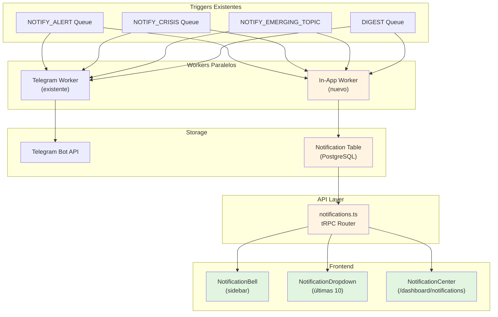

# Plan: Sprint 10 - Notificaciones In-App

**Fecha:** 2026-01-29
**Modo:** --feature
**Estado:** 🟡 Pendiente

---

## Descripción

Implementar un sistema de notificaciones in-app que funcione en paralelo con las notificaciones de Telegram existentes. Los usuarios podrán ver alertas, crisis y menciones críticas directamente en el dashboard sin depender de Telegram.

## Contexto del codebase

### Patrones identificados
- **tRPC modular**: Routers independientes con `protectedProcedure` y validación Zod
- **Multi-tenant**: Todas las queries filtran por `ctx.user.orgId`
- **Workers BullMQ**: Colas con cron patterns, workers específicos por tipo
- **Componentes UI**: Dark mode completo, skeleton loaders, constantes de config
- **Sin real-time**: Actualmente no hay WebSocket, se usa polling con tRPC queries

### Archivos relacionados
- `prisma/schema.prisma` - Modelos User, Client, Mention, CrisisAlert
- `packages/workers/src/notifications/worker.ts` - Workers de Telegram
- `packages/workers/src/queues.ts` - Definición de colas BullMQ
- `packages/web/src/server/routers/` - API tRPC
- `packages/web/src/app/dashboard/layout.tsx` - Layout principal
- `packages/web/src/components/` - Componentes reutilizables

### Dependencias afectadas
- `@mediabot/shared` - Exportar nueva cola y helpers
- `packages/workers` - Nuevo worker de notificaciones in-app
- `packages/web` - Router tRPC + componentes UI

---

## Diagrama de arquitectura



---

## Plan de implementación

### Fase 1: Modelo de datos y API (Día 1-2)

- [ ] Agregar modelo `Notification` en `prisma/schema.prisma`
- [ ] Agregar enum `NotificationType` (MENTION_CRITICAL, MENTION_HIGH, CRISIS_ALERT, WEEKLY_REPORT, EMERGING_TOPIC, SYSTEM)
- [ ] Crear `packages/web/src/server/routers/notifications.ts`
  - `list` - Paginación, filtros por tipo y leído
  - `getUnreadCount` - Contador para badge
  - `markAsRead` - Marcar una como leída
  - `markAllAsRead` - Marcar todas como leídas
- [ ] Agregar router a `_app.ts`
- [ ] Ejecutar `npx prisma db push`

### Fase 2: Worker de notificaciones in-app (Día 3)

- [ ] Crear `packages/workers/src/notifications/inapp-creator.ts`
  - Función `createInAppNotification(userId, type, title, message, data)`
  - Determinar usuarios a notificar basado en orgId y rol
- [ ] Modificar workers existentes para llamar `createInAppNotification`:
  - `worker.ts` → Alert y Crisis handlers
  - `digest.ts` → Digest handler
  - `emerging-topics-worker.ts` → Emerging topics handler
- [ ] Agregar índices de BD para performance

### Fase 3: Componentes de UI (Día 4-5)

- [ ] Crear `packages/web/src/components/notifications/NotificationBell.tsx`
  - Ícono campana con badge contador
  - Polling cada 30s con `refetchInterval`
  - Dark mode completo
- [ ] Crear `packages/web/src/components/notifications/NotificationDropdown.tsx`
  - Lista de últimas 10 notificaciones
  - Click para marcar como leída y navegar
  - Botón "Marcar todas como leídas"
- [ ] Crear `packages/web/src/components/notifications/NotificationItem.tsx`
  - Ícono por tipo (campana, alerta, tendencia, etc.)
  - Timestamp relativo
  - Indicador de no leído
- [ ] Integrar `NotificationBell` en `layout.tsx` (sidebar)

### Fase 4: Página del centro de notificaciones (Día 6)

- [ ] Crear `packages/web/src/app/dashboard/notifications/page.tsx`
  - Lista completa con paginación
  - Filtros: tipo, leído/no leído, fecha
  - Acciones: marcar leída, marcar todas
  - Empty state cuando no hay notificaciones
  - Skeleton loader
- [ ] Agregar link en sidebar

### Fase 5: Testing y polish (Día 7)

- [ ] Tests unitarios para router tRPC
- [ ] Verificar dark mode en todos los componentes
- [ ] Verificar responsive en mobile
- [ ] Documentar en README/ARCHITECTURE

---

## Archivos a crear

| Archivo | Propósito |
|---------|-----------|
| `packages/web/src/server/routers/notifications.ts` | API tRPC para notificaciones |
| `packages/workers/src/notifications/inapp-creator.ts` | Crear notificaciones in-app |
| `packages/web/src/components/notifications/NotificationBell.tsx` | Ícono con badge |
| `packages/web/src/components/notifications/NotificationDropdown.tsx` | Dropdown con lista |
| `packages/web/src/components/notifications/NotificationItem.tsx` | Item individual |
| `packages/web/src/components/notifications/index.ts` | Barrel export |
| `packages/web/src/app/dashboard/notifications/page.tsx` | Página centro |

## Archivos a modificar

| Archivo | Cambios |
|---------|---------|
| `prisma/schema.prisma` | Modelo Notification + enum NotificationType |
| `packages/web/src/server/routers/_app.ts` | Agregar notifications router |
| `packages/workers/src/notifications/worker.ts` | Llamar createInAppNotification |
| `packages/workers/src/notifications/digest.ts` | Llamar createInAppNotification |
| `packages/workers/src/workers/emerging-topics-worker.ts` | Llamar createInAppNotification |
| `packages/web/src/app/dashboard/layout.tsx` | Integrar NotificationBell |
| `packages/web/src/app/dashboard/Sidebar.tsx` | Link a /notifications |

---

## Modelo Prisma propuesto

```prisma
model Notification {
  id        String             @id @default(cuid())
  userId    String
  user      User               @relation(fields: [userId], references: [id])
  type      NotificationType
  title     String
  message   String
  data      Json?              // { mentionId, clientId, crisisAlertId, etc. }
  read      Boolean            @default(false)
  readAt    DateTime?
  createdAt DateTime           @default(now())

  @@index([userId, read])
  @@index([userId, createdAt])
}

enum NotificationType {
  MENTION_CRITICAL
  MENTION_HIGH
  CRISIS_ALERT
  WEEKLY_REPORT
  EMERGING_TOPIC
  SYSTEM
}
```

---

## Riesgos y mitigaciones

| Riesgo | Probabilidad | Impacto | Mitigación |
|--------|--------------|---------|------------|
| Performance con muchas notificaciones | Media | Alto | Índices en BD, paginación, límite de retención (90 días) |
| Polling causa carga en servidor | Baja | Medio | Intervalo de 30s, rate limiting si necesario |
| Duplicación Telegram + In-App | Baja | Bajo | Comportamiento esperado, usuarios lo prefieren |
| Notificaciones perdidas si worker falla | Media | Alto | Logs detallados, retry con BullMQ |

---

## Decisiones tomadas

| Decisión | Alternativas consideradas | Justificación |
|----------|---------------------------|---------------|
| Polling vs WebSocket | WebSocket, SSE | Polling es más simple, suficiente para 30s refresh |
| Notif por usuario vs por org | Por organización | Granularidad permite preferencias individuales |
| Soft delete vs hard delete | Hard delete | Mantener historial, agregar job de cleanup después |
| En workers existentes vs nueva cola | Nueva cola dedicada | Menos cambios, aprovecha workers existentes |

---

## Verificación

### Tests a agregar
- [ ] `notifications.test.ts` - Tests unitarios del router tRPC
- [ ] Test de integración: crear mention → verificar notificación creada

### Criterios de aceptación
- [ ] Badge muestra contador correcto de no leídas
- [ ] Dropdown muestra últimas 10 notificaciones
- [ ] Click en notificación marca como leída y navega
- [ ] Página de centro muestra todas con filtros
- [ ] Dark mode funciona en todos los componentes
- [ ] Notificaciones se crean automáticamente en eventos clave

---

## Siguiente paso

Después de implementar, ejecutar:
```bash
/dev-check --pre-commit
```

---

*Generado por `/dev-plan --feature` - 2026-01-29*
