# Plan: Corregir Grounding URLs y Mostrar Fechas de Publicación

**Fecha:** 2026-01-31
**Modo:** --bug
**Estado:** 🟢 Implementado

---

## Descripción

Dos bugs relacionados con el sistema de monitoreo de noticias:

1. **Bug 1 - Grounding devuelve 0 resultados:** Gemini con Google Search grounding genera URLs inventados en el texto de respuesta en lugar de usar los URLs reales del `groundingMetadata`. Esto causa que todas las URLs fallen validación (404) y se descarten.

2. **Bug 2 - Fechas incorrectas en UI:** Las menciones muestran `createdAt` (fecha de indexación) en lugar de `publishedAt` (fecha de publicación del artículo).

## Evidencia del Root Cause

### Bug 1: URLs inventados por Gemini

**Logs de producción:**
```
[SearchNews] Gemini found 10 articles
[SearchNews] URL returned 404: https://www.milenio.com/politica/adriandelagarza-pide-replantear...
[SearchNews] URL returned 404: https://www.milenio.com/politica/construye-monterrey-c4-sur...
... (10 URLs más con 404)
[SearchNews] Skipped 10 articles with invalid/unreachable URLs
```

**Root cause:** El código extrae URLs del texto JSON generado por Gemini (línea 183), pero Gemini "inventa" URLs que parecen reales pero no existen. Los URLs reales están disponibles en `response.candidates[0].groundingMetadata.groundingChunks` pero no se extraen.

**Archivo afectado:** `packages/workers/src/grounding/grounding-service.ts:179-205`
**Archivo afectado:** `packages/web/src/server/routers/clients.ts:299-380`

### Bug 2: Fecha de indexación vs publicación

**Código actual:**
```typescript
// mention-row.tsx:65
<span>{timeAgo(date)}</span>  // date = mention.createdAt

// mentions/page.tsx:234
date={mention.createdAt}  // Pasa createdAt, no publishedAt
```

**Root cause:** El componente recibe `mention.createdAt` pero debería recibir `article.publishedAt` con fallback a `createdAt`.

## Diagrama de arquitectura

```mermaid
flowchart TD
    subgraph "Estado Actual - Bug 1"
        A1[Gemini + googleSearch] --> B1[response.text]
        B1 --> C1[Regex extrae JSON]
        C1 --> D1[URLs inventados]
        D1 --> E1[Validación HEAD]
        E1 --> F1[404 - Descartado]
    end

    subgraph "Solución Propuesta - Bug 1"
        A2[Gemini + googleSearch] --> B2[response.candidates]
        B2 --> C2[groundingMetadata.groundingChunks]
        C2 --> D2[URLs reales de Google]
        D2 --> E2[Validación HEAD]
        E2 --> F2[200 OK - Guardado]
    end
```




## Plan de implementación

### Fase 1: Corregir extracción de URLs del grounding (Bug 1)

- [ ] **1.1** Modificar `grounding-service.ts` para extraer URLs de `groundingMetadata`
  - Acceder a `response.candidates[0].groundingMetadata.groundingChunks`
  - Cada chunk tiene `web.uri` con el URL real
  - Mantener fallback al método actual si no hay metadata

- [ ] **1.2** Modificar `clients.ts:searchNews` con la misma lógica
  - Duplicar la lógica de extracción de groundingMetadata
  - Este endpoint se usa en el wizard de onboarding

- [ ] **1.3** Agregar logging mejorado
  - Log cuando se usan URLs de groundingMetadata vs texto
  - Log cantidad de chunks encontrados

### Fase 2: Mostrar fechas de publicación en UI (Bug 2)

- [ ] **2.1** Modificar `mention-row.tsx`
  - Agregar prop `publishedAt?: Date`
  - Mostrar `publishedAt` si existe, fallback a `date`
  - Agregar indicador visual si es fecha estimada

- [ ] **2.2** Modificar `mention-timeline.tsx`
  - Usar `article.publishedAt` con fallback a `createdAt`

- [ ] **2.3** Modificar `mentions/page.tsx`
  - Pasar `publishedAt={mention.article.publishedAt}` al componente
  - Mantener `date={mention.createdAt}` como fallback

- [ ] **2.4** Modificar `mentions.ts` router
  - Asegurar que `article.publishedAt` se incluye en el select
  - Opcionalmente agregar filtro por `article.publishedAt`

### Fase 3: Redes sociales (SocialMention)

- [ ] **3.1** Verificar que `SocialMention.postedAt` se usa correctamente
  - El modelo tiene `postedAt` que es la fecha del post
  - Asegurar que la UI de redes sociales usa este campo

## Archivos a modificar

| Archivo | Cambios |
|---------|---------|
| `packages/workers/src/grounding/grounding-service.ts` | Extraer URLs de groundingMetadata |
| `packages/web/src/server/routers/clients.ts` | Misma lógica en searchNews |
| `packages/web/src/components/mention-row.tsx` | Agregar prop publishedAt |
| `packages/web/src/components/mention-timeline.tsx` | Usar publishedAt |
| `packages/web/src/app/dashboard/mentions/page.tsx` | Pasar publishedAt al componente |

## Riesgos identificados

| Riesgo | Probabilidad | Impacto | Mitigación |
|--------|--------------|---------|------------|
| groundingMetadata no disponible en todas las respuestas | Media | Bajo | Mantener fallback al método actual |
| Estructura de groundingMetadata diferente a esperada | Baja | Medio | Logging detallado y validación |
| URLs de groundingMetadata también inválidos | Baja | Bajo | Mantener validación HTTP existente |

## Verificación

- [ ] Crear cliente con nombre de figura pública (ej: "Adrian de la Garza")
- [ ] Verificar que grounding encuentra artículos con URLs válidos
- [ ] Verificar que las menciones muestran fecha de publicación
- [ ] Verificar que el fallback a createdAt funciona si no hay publishedAt
- [ ] Verificar logs en producción

## Decisiones tomadas

| Decisión | Alternativas | Justificación |
|----------|--------------|---------------|
| Extraer de groundingMetadata | Usar Google Custom Search API separada | groundingMetadata ya tiene los datos, es más eficiente |
| Mantener fallback al texto | Solo usar groundingMetadata | Compatibilidad con respuestas sin metadata |
| Agregar publishedAt como prop separada | Reemplazar date | Permite mostrar ambas fechas si necesario |

---

*Generado por `/dev-plan --bug` - 2026-01-31*
